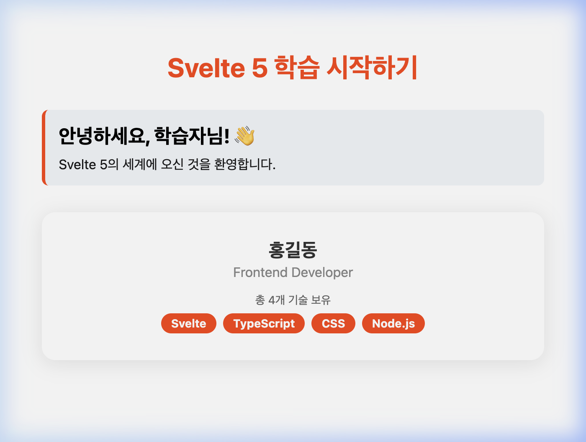

# 🧱 Step 01: Svelte 기초

## 학습 목표
- Svelte 컴포넌트 구조 (script, markup, style)
- 템플릿 표현식 `{variable}`
- `$props()` 로 컴포넌트 속성 받기
- 컴포넌트 분리 및 임포트

---

## 개념 설명

### 컴포넌트 구조

Svelte 컴포넌트는 `.svelte` 파일 하나에 3개 영역으로 구성됩니다:

```svelte
<script lang="ts">
  // 1. 로직 — 변수, 함수, import
  let name = 'Svelte';
</script>

<!-- 2. 마크업 — HTML + 표현식 -->
<h1>안녕하세요, {name}!</h1>
<p>2 + 3 = {2 + 3}</p>

<style>
  /* 3. 스타일 — 이 컴포넌트에만 적용 (Scoped) */
  h1 { color: #ff3e00; }
</style>
```

### `$props()` — 컴포넌트 속성 (Props)

컴포넌트 외부(부모)에서 데이터를 전달받을 때는 `$props()` 마법의 함수(Rune)를 사용합니다. TypeScript와 함께 사용하면 "어떤 데이터"가 "어떤 타입"으로 들어와야 하는지, 그리고 "필수인지 선택인지" 명확하게 정의할 수 있습니다.

```svelte
<script lang="ts">
  // 1. let { ... } : 객체 구조 분해 할당으로 전달받은 속성들을 변수로 선언합니다.
  //                 message = '...' 와 같이 기본값을 설정할 수도 있습니다.
  // 2. : { ... } : TypeScript로 각 속성이 가져야 할 형태(Type)를 정의합니다.
  // 3. = $props() : 외부에서 속성을 가져오는 Svelte 5 핵심 명령입니다.
  let { name, message = 'Welcome!' }: {
    name: string;       // name은 반드시 문자열이어야 함 (필수)
    message?: string;   // message는 나중에 값이 들어올 수도 안 올수도 있음 (선택 사항)
  } = $props();
</script>

<h2>안녕하세요, {name}님!</h2>
<p>{message}</p>
```

---

## 실습: 파일 생성

> 모든 파일은 `examples/basic-app/` 내부에 생성합니다.

### 💡 [선행 학습] Svelte 파일 이름 짓기 규칙
실습을 시작하기 전에 Svelte의 중요한 파일 이름 규칙 두 가지를 알아둡니다:
1. **일반 컴포넌트 (`PascalCase.svelte`)**: 부품으로 쓰이는 화면 조각들은 무조건 **대문자로 시작**하는 파스칼 케이스(예: `ProfileCard.svelte`, `Greeting.svelte`)로 짓습니다. 소문자로 지으면 HTML 기본 태그와 충돌할 수 있기 때문입니다.
2. **페이지 라우트 (`+page.svelte`)**: 사용자가 URL로 접속해서 보는 화면(페이지)은 SvelteKit 규칙에 따라 무조건 `+` 기호가 붙은 소문자 이름이어야 합니다.

**📂 일반적인 디렉토리 구조 예시:**
```text
src/
├── lib/
│   └── components/
│       ├── Greeting.svelte     (✅ 부품: 대문자로 시작)
│       └── ProfileCard.svelte  (✅ 부품: 대문자로 시작)
└── routes/
    ├── +page.svelte            (✅ 화면: 메인 홈페이지 /)
    └── about/
        └── +page.svelte        (✅ 화면: 소개 페이지 /about)
```

---

### 1. `src/lib/components/Greeting.svelte` 생성

```svelte
<script lang="ts">
  let { name, message = 'Welcome!' }: {
    name: string;
    message?: string;
  } = $props();
</script>

<div class="greeting">
  <h2>안녕하세요, {name}님!</h2>
  <p>{message}</p>
</div>

<style>
  .greeting {
    padding: 1.5rem;
    border-radius: 12px;
    background: linear-gradient(135deg, #667eea, #764ba2);
    color: white;
    text-align: center;
  }
  h2 { margin: 0 0 0.5rem; }
  p { margin: 0; opacity: 0.9; }
</style>
```

### 2. `src/lib/components/ProfileCard.svelte` 생성

이 예제에서는 Svelte의 특별한 형태인 **논리 블록(Logic Blocks)**을 사용해 봅니다. HTML 안에 조건이나 반복문을 쓸 때 `{#...}` 기호로 시작하고 `{/...}` 기호로 닫습니다.
- `{#if 조건}` ... `{/if}` : 조건이 참일 때만 그리기
- `{#each 배열 as 아이템}` ... `{/each}` : 배열 데이터만큼 반복해서 그리기

```svelte
<script lang="ts">
  let { name, title, skills = [] }: {
    name: string;
    title: string;
    skills?: string[];
  } = $props();
</script>

<div class="card">
  <h3>{name}</h3>
  <p class="title">{title}</p>
  {#if skills.length > 0}
    <p class="skills">총 {skills.length}개 기술 보유</p>
    <div class="tags">
      {#each skills as skill}
        <span class="tag">{skill}</span>
      {/each}
    </div>
  {/if}
</div>

<style>
  .card {
    padding: 2rem; border-radius: 16px;
    background: white; box-shadow: 0 4px 24px rgba(0,0,0,0.1);
    text-align: center;
  }
  h3 { margin: 0 0 0.25rem; color: #333; font-size: 1.4rem; }
  .title { color: #888; margin: 0 0 1rem; }
  .tags { display: flex; gap: 0.5rem; justify-content: center; flex-wrap: wrap; }
  .tag {
    padding: 0.25rem 0.75rem; background: #e3f2fd;
    color: #1565c0; border-radius: 20px; font-size: 0.85rem;
  }
  .skills { color: #666; font-size: 0.9rem; }
</style>
```

### 3. `src/routes/+page.svelte` 수정

```svelte
<script lang="ts">
  import Greeting from '$lib/components/Greeting.svelte';
  import ProfileCard from '$lib/components/ProfileCard.svelte';

  const skills = ['Svelte', 'TypeScript', 'CSS', 'Node.js'];
</script>

<main>
  <h1>Step 01: Svelte 기초</h1>

  <Greeting name="학습자" />
  <Greeting name="Svelte" message="Svelte 5에 오신 것을 환영합니다!" />

  <ProfileCard
    name="홍길동"
    title="Frontend Developer"
    skills={skills}
  />
</main>

<style>
  main {
    max-width: 600px; margin: 0 auto; padding: 2rem;
    font-family: 'Inter', system-ui, sans-serif;
    display: flex; flex-direction: column; gap: 1.5rem;
  }
  h1 { color: #ff3e00; text-align: center; }
</style>
```

---

## 확인

```bash
npm run dev
```

브라우저에서 `http://localhost:5174` 접속 후 다음 화면이 나오는지 확인합니다:

<div align="center">
  
  <p><em>(완성된 컴포넌트 실습 화면)</em></p>
</div>

- 인사말 컴포넌트 렌더링
- 프로필 컴포넌트 렌더링 (기술 배지 포함)

---

## 🎯 다음 단계

[03-runes.md](./03-runes.md) →

