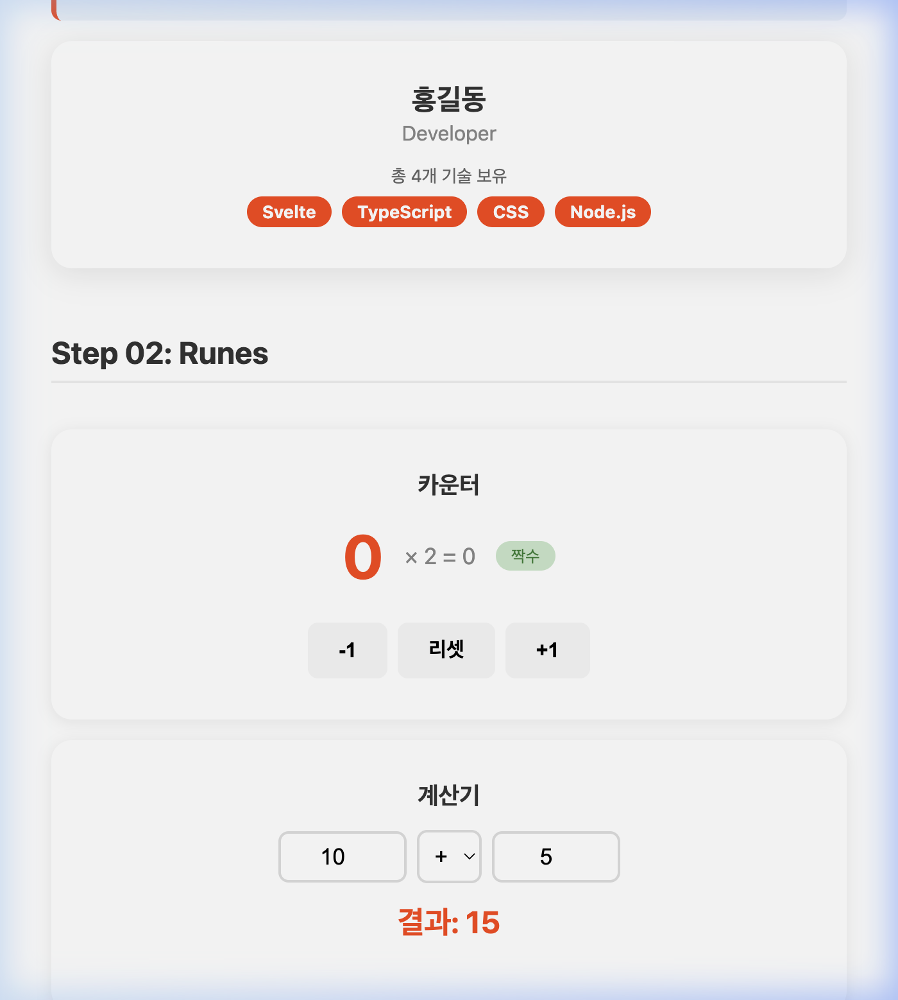

# 🔮 Step 02: Runes 핵심

## 학습 목표
- `$state` — 반응형 상태
- `$derived` / `$derived.by` — 파생 값
- `$effect` — 사이드 이펙트
- `$props` — 컴포넌트 속성 (복습)

---

## 개념 설명

Svelte 5에서 가장 핵심적인 변화는 **Runes(룬)**의 도입입니다. Rune은 `$` 기호로 시작하는 특별한 키워드(예: `$state`, `$derived`)로, Svelte 컴파일러에게 **"이 변수는 특별한 역할을 한다"**고 알려주는 주문(incantation) 같은 것입니다.

> **왜 Rune이 필요할까?** 일반 JavaScript 변수(`let count = 0`)는 값이 바뀌어도 화면(UI)에 자동으로 반영되지 않습니다. Rune을 사용하면, 변수의 값이 변경될 때 화면도 자동으로 다시 그려지는 **반응성(Reactivity)**을 얻게 됩니다.

---

### `$state` — 반응형 상태 (가장 기본!)

**역할**: 값이 바뀌면 해당 값을 사용하는 **화면(UI)이 자동으로 다시 그려지는** 변수를 선언합니다.

**사용 위치**: `.svelte` 파일의 `<script>` 블록 안에서만 사용합니다.

```svelte
<script lang="ts">
  let count = $state(0);           // 숫자 0으로 시작하는 반응형 변수
  let items = $state<string[]>([]); // 빈 배열로 시작 (타입을 명시)
</script>

<!-- count 값이 바뀔 때마다, 아래 {count} 부분만 자동으로 갱신됩니다 -->
<p>현재 카운트: {count}</p>
<button onclick={() => count++}>+1</button>
```

**핵심 정리**:
- `$state(초기값)` 형태로 선언합니다.
- 이 변수의 값을 바꾸는 것만으로 화면이 자동 업데이트됩니다.
- 배열이나 객체처럼 타입 추론이 어려운 경우, `$state<타입>(초기값)` 형태로 타입을 명시합니다. (01-typescript 문서의 **제네릭** 참고)

> **🔄 React 비교**: React의 `const [count, setCount] = useState(0)`과 같은 역할입니다. 다만 Svelte에서는 `setCount` 같은 별도의 setter 함수 없이 `count++`처럼 **직접 값을 대입**하면 됩니다.

---

### `$derived` / `$derived.by` — 파생 값 (다른 상태에서 자동으로 계산)

**역할**: 기존 `$state` 변수의 값이 바뀔 때마다, 그 값을 기반으로 **자동으로 다시 계산되는** 읽기 전용(read-only) 변수를 만듭니다. 스프레드시트에서 셀에 수식(`=A1*2`)을 넣어두면 A1이 바뀔 때마다 자동으로 결과가 바뀌는 것과 같습니다.

**사용 위치**: `$state`와 마찬가지로 `.svelte` 파일의 `<script>` 블록 안에서 사용합니다.

```svelte
<script lang="ts">
  let count = $state(0);

  // ✅ 단순 표현식: count가 바뀌면 doubled도 자동으로 바뀜
  let doubled = $derived(count * 2);

  // ✅ 복잡한 로직이 필요할 때: $derived.by(() => { ... })
  let info = $derived.by(() => {
    if (count > 10) return '많음';
    return '적음';
  });
</script>

<p>{count} × 2 = {doubled}</p>  <!-- count가 5면 "5 × 2 = 10" -->
<p>상태: {info}</p>              <!-- count가 3이면 "적음" -->
```

**핵심 정리**:
- `$derived(간단한 수식)` : 한 줄로 끝나는 단순 계산에 사용합니다.
- `$derived.by(() => { ... })` : if문, switch문 등 여러 줄의 로직이 필요할 때 사용합니다.
- **⭐ 추적 범위**: `$effect`와 마찬가지로, 수식/함수 안에서 **실제로 읽힌 `$state`만** 감시합니다. 예를 들어 `$derived(count * 2)`는 `count`가 바뀔 때만 재계산되고, 같은 컴포넌트에 있는 다른 `$state`(예: `name`)가 바뀌어도 재계산되지 않습니다.

> **🔄 React 비교**: React의 `useMemo(() => count * 2, [count])`와 유사합니다. 하지만 Svelte에서는 의존성 배열(`[count]`)을 직접 적을 필요 없이 자동 추적됩니다.

---

### `$effect` — 사이드 이펙트 (값이 바뀐 후 뭔가를 실행)

**역할**: `$state`나 `$derived` 변수가 바뀔 때마다, 화면 렌더링과는 별개로 **추가 작업을 자동 실행**합니다. 예를 들어 콘솔에 로그를 출력하거나, localStorage에 저장하거나, 외부 API를 호출하는 등의 작업입니다.

**사용 위치**: `.svelte` 파일의 `<script>` 블록 안에서 사용합니다.

**⭐ 추적 범위**: 모든 `$state`가 아니라, `$effect` **함수 본문 안에서 실제로 읽힌 변수만** 감시합니다. Svelte가 첫 실행 시 어떤 변수가 읽혔는지 자동으로 파악합니다.

```svelte
<script lang="ts">
  let count = $state(0);
  let name = $state('앨리스');

  // ✅ 이 $effect는 count'만' 읽고 있으므로, count가 바뀔 때만 실행됩니다.
  //    name이 바뀌어도 이 $effect는 실행되지 않습니다!
  $effect(() => {
    console.log(`count가 ${count}로 변경됨`);
  });

  // ✅ 이 $effect는 name'만' 읽고 있으므로, name이 바뀔 때만 실행됩니다.
  $effect(() => {
    console.log(`name이 ${name}으로 변경됨`);
    // 🧹 클린업 함수: 다음 실행 전 또는 컴포넌트가 사라질 때 호출됩니다.
    return () => { console.log('이전 효과 정리'); };
  });
</script>
```

**핵심 정리**:
- `$effect` 안에서 읽히는 `$state`/`$derived` 변수를 Svelte가 **자동 추적**합니다. 따로 "어떤 변수를 감시해라"라고 지정할 필요가 없습니다. (React의 `useEffect([count])` 같은 의존성 배열이 필요 없음)
- `return () => { ... }` 형태의 **클린업 함수**를 반환하면, 다음 번 effect 실행 전이나 컴포넌트가 화면에서 사라질 때 정리 작업을 수행합니다. (타이머 해제, 이벤트 리스너 제거 등)
- ⚠️ `$effect` 안에서 **자신이 추적하는** `$state` 변수의 값을 직접 바꾸면 **무한 루프**가 발생할 수 있으므로 주의해야 합니다.

---

### `$props` — 컴포넌트 속성 (부모 → 자식 데이터 전달, 복습)

**역할**: 부모 컴포넌트가 자식에게 **외부에서 전달하는 데이터**를 선언합니다. 이전 Step(02-svelte-basics)에서 이미 배웠으므로 복습입니다.

**사용 위치**: `.svelte` 파일의 `<script>` 블록 안에서 사용합니다.

```svelte
<!-- 자식 컴포넌트: Counter.svelte -->
<script lang="ts">
  let { initialCount = 0 }: { initialCount?: number } = $props();
  let count = $state(initialCount);
</script>

<!-- 부모 컴포넌트에서 사용 -->
<!-- <Counter initialCount={10} /> -->
```

**핵심 정리**:
- `$props()`는 부모로부터 받을 데이터의 **구조와 타입**을 구조 분해 할당으로 선언합니다. (01-typescript 문서의 **객체 구조 분해 할당** 참고)
- `$props()`로 받은 값 자체는 **읽기 전용**입니다. 값을 바꾸고 싶다면 별도의 `$state` 변수에 복사하여 사용합니다.

### 💡 [선행 학습] Svelte 핵심 디렉티브 미리보기 (`class:`, `bind:`)

앞으로 진행될 실습 코드에서 상태(`$state`)를 화면에 연결하기 위해 아래 두 가지 특수 문법이 미리 등장합니다.

1. **조건부 클래스 (`class:이름={조건}`)**
   - 조건이 **참(true)**일 때만 HTML 요소에 해당 클래스를 추가합니다.
   - 예: `<span class="badge" class:even={isEven}>` (만약 `isEven`이 참이라면 `class="badge even"`이 됨)

2. **양방향 바인딩 (`bind:속성={변수}`)**
   - 폼 요소(input, select 등)의 값과 Svelte 변수를 **서로 묶어줍니다(양방향 연결)**. 사용자가 입력창에 값을 치면 변수도 바뀌고, 코드로 변수를 바꾸면 입력창의 값도 바뀝니다.
   - 예: `<input type="number" bind:value={a} />`

---

## 실습: 파일 생성

### 1. `src/lib/components/Counter.svelte` 생성

```svelte
<script lang="ts">
  let count = $state(0);
  let doubled = $derived(count * 2);
  let isEven = $derived(count % 2 === 0);

  function increment() { count++; }
  function decrement() { count--; }
  function reset() { count = 0; }
</script>

<div class="counter">
  <h3>카운터</h3>
  <div class="display">
    <span class="number">{count}</span>
    <span class="info">× 2 = {doubled}</span>
    <span class="badge" class:even={isEven}>{isEven ? '짝수' : '홀수'}</span>
  </div>
  <div class="buttons">
    <button onclick={decrement}>-1</button>
    <button onclick={reset}>리셋</button>
    <button onclick={increment}>+1</button>
  </div>
</div>

<style>
  .counter { padding: 2rem; border-radius: 16px; background: white; box-shadow: 0 2px 12px rgba(0,0,0,0.08); text-align: center; }
  h3 { margin: 0 0 1rem; color: #333; }
  .display { display: flex; align-items: center; justify-content: center; gap: 1rem; margin-bottom: 1.5rem; }
  .number { font-size: 3rem; font-weight: bold; color: #ff3e00; }
  .info { color: #888; font-size: 1.1rem; }
  .badge { padding: 0.25rem 0.75rem; border-radius: 20px; background: #e0e0e0; font-size: 0.8rem; }
  .badge.even { background: #c8e6c9; color: #2e7d32; }
  .buttons { display: flex; gap: 0.5rem; justify-content: center; }
  button { padding: 0.75rem 1.5rem; border: none; border-radius: 8px; background: #f5f5f5; cursor: pointer; font-size: 1rem; font-weight: bold; transition: background 0.2s; }
  button:hover { background: #e0e0e0; }
</style>
```

### 2. `src/lib/components/Calculator.svelte` 생성

```svelte
<script lang="ts">
  let a = $state(10);
  let b = $state(5);
  let operator = $state<'+' | '-' | '×' | '÷'>('+');

  let result = $derived.by(() => {
    switch (operator) {
      case '+': return a + b;
      case '-': return a - b;
      case '×': return a * b;
      case '÷': return b !== 0 ? a / b : NaN;
    }
  });

  let resultText = $derived(
    Number.isNaN(result) ? '계산 불가 (0으로 나눔)' : `결과: ${result}`
  );
</script>

<div class="calc">
  <h3>계산기</h3>
  <div class="inputs">
    <input type="number" bind:value={a} />
    <select bind:value={operator}>
      <option>+</option><option>-</option><option>×</option><option>÷</option>
    </select>
    <input type="number" bind:value={b} />
  </div>
  <p class="result">{resultText}</p>
</div>

<style>
  .calc { padding: 2rem; border-radius: 16px; background: white; box-shadow: 0 2px 12px rgba(0,0,0,0.08); text-align: center; }
  h3 { margin: 0 0 1rem; color: #333; }
  .inputs { display: flex; gap: 0.5rem; justify-content: center; align-items: center; }
  input { width: 80px; padding: 0.5rem; border: 2px solid #ddd; border-radius: 8px; text-align: center; font-size: 1.1rem; }
  select { padding: 0.5rem; border: 2px solid #ddd; border-radius: 8px; font-size: 1.1rem; }
  .result { font-size: 1.5rem; font-weight: bold; color: #ff3e00; margin-top: 1rem; }
</style>
```

### 3. `src/routes/+page.svelte` 수정

기존 Step 01 코드 **아래에** 추가:

```svelte
<script lang="ts">
  import Greeting from '$lib/components/Greeting.svelte';
  import ProfileCard from '$lib/components/ProfileCard.svelte';
  import Counter from '$lib/components/Counter.svelte';
  import Calculator from '$lib/components/Calculator.svelte';

  const skills = ['Svelte', 'TypeScript', 'CSS', 'Node.js'];
</script>

<main>
  <h1>Svelte 5 학습</h1>

  <section>
    <h2>Step 01: 기초</h2>
    <Greeting name="학습자" />
    <ProfileCard name="홍길동" title="Developer" skills={skills} />
  </section>

  <section>
    <h2>Step 02: Runes</h2>
    <Counter />
    <Calculator />
  </section>
</main>

<style>
  main { max-width: 700px; margin: 0 auto; padding: 2rem; font-family: 'Inter', system-ui, sans-serif; }
  h1 { color: #ff3e00; text-align: center; }
  section { margin: 2rem 0; display: flex; flex-direction: column; gap: 1rem; }
  h2 { color: #333; border-bottom: 2px solid #eee; padding-bottom: 0.5rem; }
</style>
```

---

## 확인

브라우저에서 `http://localhost:5174` 접속 후 다음 화면이 나오는지 확인합니다:

<div align="center">
  
  <p><em>(카운터 + 계산기 실습 화면)</em></p>
</div>

- 카운터의 +/-/리셋 버튼이 동작하는지 확인
- `$derived`: 두 배 값과 짝/홀 배지가 자동 업데이트되는지 확인
- 계산기: 숫자와 연산자 변경 시 결과가 즉시 갱신되는지 확인

---

## 🎯 다음 단계

[04-events-bindings.md](./04-events-bindings.md) →
