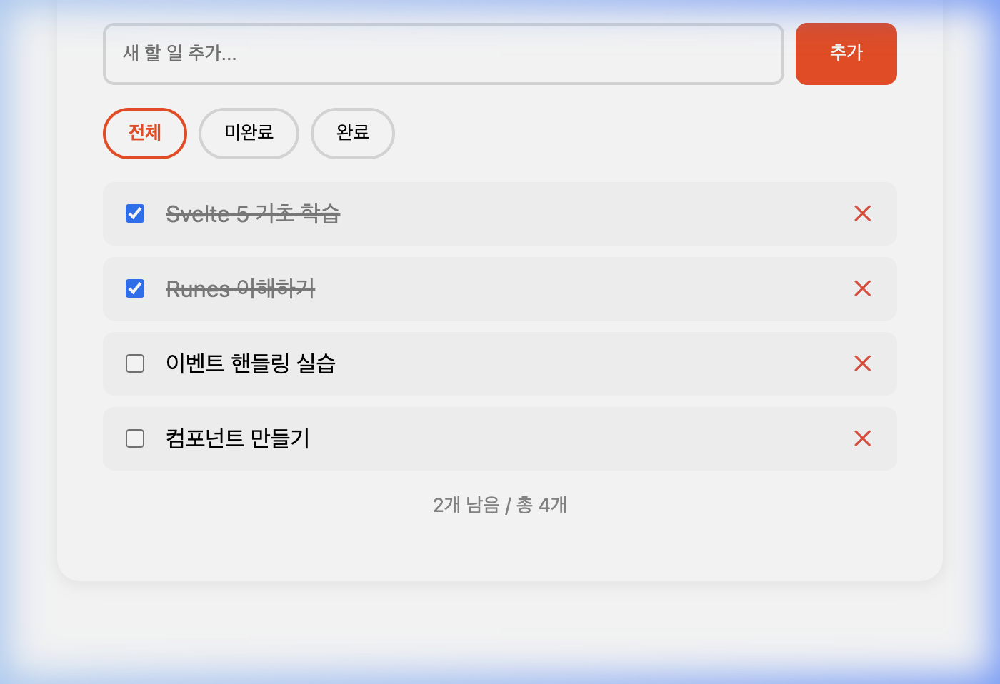

# 🔄 Step 04: 조건부 렌더링 & 반복

## 학습 목표
- `{#if}` / `{:else if}` / `{:else}` 조건부 렌더링
- `{#each}` 리스트 렌더링과 키
- `{:else}` 빈 리스트 처리
- `{#await}` 비동기 데이터 처리

---

## 개념 설명

```svelte
<!-- 조건부 -->
{#if score >= 90}
  <p>A 등급</p>
{:else if score >= 80}
  <p>B 등급</p>
{:else}
  <p>C 등급</p>
{/if}

<!-- 반복 (키 필수!) -->
<!-- (item.id)가 키(key) 역할: 항목이 추가/삭제/재정렬될 때 -->
<!-- Svelte가 어떤 DOM 요소가 어떤 데이터인지 정확히 식별할 수 있게 해줍니다 -->
{#each items as item (item.id)}
  <div>{item.text}</div>
{:else}
  <p>비어있음</p>
{/each}

<!-- 비동기 -->
{#await promise}
  <p>로딩...</p>
{:then data}
  <p>{data.name}</p>
{:catch error}
  <p>에러: {error.message}</p>
{/await}
```

> **🔄 React 비교**: React에서는 조건부 렌더링에 `{condition ? <A/> : <B/>}` 삼항 연산자를, 리스트에는 `{items.map(item => <div key={item.id}>...</div>)}` 패턴을 씁니다. Svelte는 `{#if}`, `{#each}` 같은 **전용 블록 문법**을 제공하여 가독성이 더 좋고, `{:else}`로 빈 리스트 처리까지 깔끔하게 할 수 있습니다.

---

## 실습: 파일 생성

### 1. `src/lib/components/TodoList.svelte` 생성

```svelte
<script lang="ts">
  interface Todo {
    id: number;
    text: string;
    done: boolean;
  }

  // 실습용 기본 데이터 (실제 앱이라면 서버에서 가져옴)
  // done: true/false를 섞어둔 이유 → 필터 기능 테스트 시 결과 차이를 바로 확인 가능
  let todos = $state<Todo[]>([
    { id: 1, text: 'Svelte 5 기초 학습', done: true },
    { id: 2, text: 'Runes 이해하기', done: true },
    { id: 3, text: '이벤트 핸들링 실습', done: false },
    { id: 4, text: '컴포넌트 만들기', done: false }
  ]);

  let newTodo = $state('');
  let nextId = $state(5);
  // 리터럴 유니온 타입: filter에는 'all', 'active', 'done' 3가지 문자열만 허용됩니다.
  // TypeScript의 enum과 비슷하지만 더 간결한 방식입니다. (01-typescript 문서의 Union Types 참고)
  let filter = $state<'all' | 'active' | 'done'>('all');

  let filteredTodos = $derived.by(() => {
    switch (filter) {
      case 'active': return todos.filter(t => !t.done);
      case 'done': return todos.filter(t => t.done);
      default: return todos;
    }
  });

  let remaining = $derived(todos.filter(t => !t.done).length);

  function addTodo() {
    if (newTodo.trim()) {
      todos.push({ id: nextId++, text: newTodo.trim(), done: false });
      newTodo = '';
    }
  }

  function removeTodo(id: number) {
    todos = todos.filter(t => t.id !== id);
  }
</script>

<div class="todo-app">
  <div class="input-group">
    <input bind:value={newTodo} onkeydown={(e) => e.key === 'Enter' && addTodo()} placeholder="새 할 일 추가..." />
    <button onclick={addTodo}>추가</button>
  </div>

  <div class="filters">
    <button class:active={filter === 'all'} onclick={() => filter = 'all'}>전체</button>
    <button class:active={filter === 'active'} onclick={() => filter = 'active'}>미완료</button>
    <button class:active={filter === 'done'} onclick={() => filter = 'done'}>완료</button>
  </div>

  {#each filteredTodos as todo (todo.id)}
    <div class="todo-item" class:done={todo.done}>
      <input type="checkbox" bind:checked={todo.done} />
      <span>{todo.text}</span>
      <button class="delete" onclick={() => removeTodo(todo.id)}>✕</button>
    </div>
  {:else}
    <p class="empty">항목이 없습니다 🎉</p>
  {/each}

  {#if todos.length > 0}
    <p class="status">{remaining}개 남음 / 총 {todos.length}개</p>
  {/if}
</div>

<style>
  .todo-app { padding: 2rem; border-radius: 16px; background: white; box-shadow: 0 2px 12px rgba(0,0,0,0.08); }
  .input-group { display: flex; gap: 0.5rem; margin-bottom: 1rem; }
  .input-group input { flex: 1; padding: 0.75rem; border: 2px solid #ddd; border-radius: 8px; }
  .input-group button { padding: 0.75rem 1.5rem; background: #ff3e00; color: white; border: none; border-radius: 8px; cursor: pointer; }
  .filters { display: flex; gap: 0.5rem; margin-bottom: 1rem; }
  .filters button { padding: 0.5rem 1rem; border: 2px solid #ddd; background: white; border-radius: 20px; cursor: pointer; }
  .filters button.active { border-color: #ff3e00; color: #ff3e00; font-weight: bold; }
  .todo-item { display: flex; align-items: center; gap: 0.75rem; padding: 0.75rem; border-radius: 8px; margin-bottom: 0.5rem; background: #f9f9f9; }
  .todo-item.done span { text-decoration: line-through; opacity: 0.5; }
  .todo-item span { flex: 1; }
  .delete { background: none; border: none; color: #f44336; cursor: pointer; font-size: 1rem; }
  .empty { text-align: center; color: #888; padding: 2rem; }
  .status { text-align: center; color: #888; font-size: 0.85rem; margin-top: 1rem; }
</style>
```

### 2. `src/routes/+page.svelte`에 추가

```svelte
import TodoList from '$lib/components/TodoList.svelte';
```

```svelte
<section>
  <h2>Step 04: 조건부 렌더링 & 반복</h2>
  <TodoList />
</section>
```

---

## 확인

브라우저에서 `http://localhost:5174` 접속 후 다음 화면이 나오는지 확인합니다:

<div align="center">
  
  <p><em>(할 일 목록 실습 화면)</em></p>
</div>

- 할 일 추가/삭제 기능
- 체크박스로 완료 토글
- 필터(전체/미완료/완료) 작동
- 빈 필터 결과 시 "항목이 없습니다" 메시지

---

## 🎯 다음 단계

[06-components-advanced.md](./06-components-advanced.md) →
