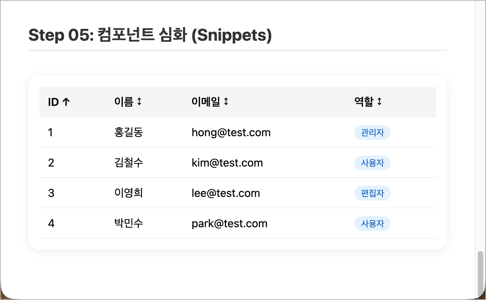

# 🧩 Step 05: 컴포넌트 심화

## 학습 목표
- Snippets (`{#snippet}` + `{@render}`)
- Context API (`setContext` / `getContext`)
- `$bindable` props
- 컴포넌트 구성 패턴

---

## 개념 설명

### Snippets (슬롯 대체) — 재사용 가능한 마크업 조각

**역할**: 같은 컴포넌트 안에서 **반복적으로 사용하는 HTML 조각**을 함수처럼 정의하고, 필요한 곳에서 호출하여 렌더링합니다. Svelte 5에서 기존의 `<slot>` 문법을 대체합니다.

**언제 쓰나?**: 리스트의 각 항목 템플릿, 탭의 콘텐츠 영역 등 **동일한 구조를 데이터만 바꿔서 여러 번** 그려야 할 때 유용합니다.

```svelte
<!-- 1. {#snippet 이름(매개변수)} 으로 마크업 조각을 정의합니다 -->
{#snippet itemTemplate(name: string)}
  <li>{name}</li>
{/snippet}

<!-- 2. {@render 이름(인수)} 로 원하는 곳에서 호출합니다 -->
{@render itemTemplate('Apple')}
{@render itemTemplate('Banana')}
{@render itemTemplate('Cherry')}
<!-- 위 코드는 <li>Apple</li> <li>Banana</li> <li>Cherry</li> 를 렌더링합니다 -->
```

**핵심 정리**:
- `{#snippet}` 으로 **정의**, `{@render}` 로 **호출**합니다.
- 일반 함수처럼 **매개변수**를 받을 수 있어서, 데이터에 따라 다른 내용을 렌더링합니다.
- Snippet을 자식 컴포넌트에 **props로 전달**하면, 부모가 자식의 렌더링 방식을 커스터마이징할 수도 있습니다. (React의 Render Props 패턴과 유사)

---

### Context API — props 없이 깊은 자식에게 데이터 전달

**역할**: 부모 → 자식 → 손자 → ... 처럼 **여러 단계를 거쳐 데이터를 전달**해야 할 때, 중간 컴포넌트들에 일일이 props를 달지 않고 바로 접근할 수 있게 해주는 기능입니다.

**언제 쓰나?**: 테마(다크/라이트 모드), 로그인 사용자 정보, 다국어 설정 등 **앱 전역에서 공유**되는 데이터에 적합합니다.

```svelte
<!-- 부모 컴포넌트: 데이터를 '등록'합니다 -->
<script>
  import { setContext } from 'svelte';
  // 'theme'이라는 이름(키)으로 데이터를 등록
  setContext('theme', { color: 'dark', fontSize: 16 });
</script>

<!-- 자식/손자 컴포넌트 (깊이 무관): 데이터를 '꺼내 씁니다' -->
<script>
  import { getContext } from 'svelte';
  // 같은 이름(키)으로 데이터를 꺼냄
  const theme = getContext('theme');
  // theme.color → 'dark', theme.fontSize → 16
</script>
```

> **🔄 React 비교**: React의 `createContext` + `useContext`와 동일한 패턴입니다. 다만 Svelte에서는 Provider 래퍼 컴포넌트(`<ThemeContext.Provider>`)로 감쌀 필요 없이, `setContext`만 호출하면 모든 하위 컴포넌트에서 접근 가능합니다.

**핵심 정리**:
- `setContext('키', 값)` : 부모에서 데이터를 등록합니다.
- `getContext('키')` : 자식에서 같은 키로 데이터를 가져옵니다.
- **⚠️ 주의**: `setContext`/`getContext`는 컴포넌트 초기화 시(`<script>` 최상단)에만 호출 가능합니다. 이벤트 핸들러나 `$effect` 안에서는 사용할 수 없습니다.

---

### `$bindable` — 부모↔자식 양방향 연결을 허용하는 props

**역할**: 일반적으로 `$props()`로 받은 값은 **읽기 전용**입니다. 하지만 `$bindable()`을 사용하면, 부모가 `bind:`로 연결하여 **자식이 값을 바꾸면 부모의 변수도 함께 바뀌는** 양방향 바인딩을 허용할 수 있습니다.

**언제 쓰나?**: 커스텀 입력 컴포넌트(검색창, 드롭다운 등)를 만들 때, 부모가 자식의 입력값을 쉽게 추적해야 하는 경우에 사용합니다.

```svelte
<!-- 자식 컴포넌트: MyInput.svelte -->
<script>
  // $bindable()로 선언하면 부모에서 bind:를 사용할 수 있게 됩니다
  let { value = $bindable('') } = $props();
</script>
<input bind:value={value} placeholder="검색어 입력..." />

<!-- 부모 컴포넌트 -->
<script>
  let query = $state('');
</script>
<!-- bind:value로 부모의 query와 자식의 value가 서로 연결됩니다 -->
<MyInput bind:value={query} />
<p>검색어: {query}</p> <!-- 자식의 input에 타이핑하면 여기도 자동 갱신! -->
```

**핵심 정리**:
- `$bindable()` 없이 선언된 props에 `bind:`를 쓰면 **에러**가 납니다.
- 양방향 바인딩이 필요한 props만 선택적으로 `$bindable()`로 열어줄 수 있어서, **의도하지 않은 데이터 역류를 방지**합니다.

---

## 실습: 파일 생성

### 1. `src/lib/components/DataTable.svelte` 생성

```svelte
<script lang="ts">
  interface User {
    id: number;
    name: string;
    email: string;
    role: string;
  }

  let users = $state<User[]>([
    { id: 1, name: '홍길동', email: 'hong@test.com', role: '관리자' },
    { id: 2, name: '김철수', email: 'kim@test.com', role: '사용자' },
    { id: 3, name: '이영희', email: 'lee@test.com', role: '편집자' },
    { id: 4, name: '박민수', email: 'park@test.com', role: '사용자' }
  ]);

  // keyof User → 'id' | 'name' | 'email' | 'role' 와 동일합니다.
  // User에 필드를 추가/삭제하면 자동으로 반영되므로 수동 동기화가 필요 없습니다.
  let sortField = $state<keyof User>('id');
  let sortAsc = $state(true);

  let sorted = $derived.by(() => {
    return [...users].sort((a, b) => {
      const valA = String(a[sortField]);
      const valB = String(b[sortField]);
      return sortAsc ? valA.localeCompare(valB) : valB.localeCompare(valA);
    });
  });

  function toggleSort(field: keyof User) {
    if (sortField === field) { sortAsc = !sortAsc; }
    else { sortField = field; sortAsc = true; }
  }

  function getSortIcon(field: keyof User): string {
    if (sortField !== field) return '↕';
    return sortAsc ? '↑' : '↓';
  }
</script>

{#snippet headerCell(field: keyof User, label: string)}
  <th onclick={() => toggleSort(field)} class="sortable">
    {label} {getSortIcon(field)}
  </th>
{/snippet}

<div class="table-wrapper">
  <table>
    <thead>
      <tr>
        {@render headerCell('id', 'ID')}
        {@render headerCell('name', '이름')}
        {@render headerCell('email', '이메일')}
        {@render headerCell('role', '역할')}
      </tr>
    </thead>
    <tbody>
      {#each sorted as user (user.id)}
        <tr>
          <td>{user.id}</td>
          <td>{user.name}</td>
          <td>{user.email}</td>
          <td><span class="badge">{user.role}</span></td>
        </tr>
      {/each}
    </tbody>
  </table>
</div>

<style>
  .table-wrapper { padding: 1rem; border-radius: 16px; background: white; box-shadow: 0 2px 12px rgba(0,0,0,0.08); overflow-x: auto; }
  table { width: 100%; border-collapse: collapse; }
  th, td { padding: 0.75rem; text-align: left; border-bottom: 1px solid #eee; }
  th { background: #f5f5f5; font-weight: 600; }
  .sortable { cursor: pointer; user-select: none; }
  .sortable:hover { background: #e0e0e0; }
  .badge { padding: 0.2rem 0.6rem; border-radius: 12px; background: #e3f2fd; color: #1565c0; font-size: 0.8rem; }
</style>
```

### 2. `src/routes/+page.svelte`에 추가

```svelte
import DataTable from '$lib/components/DataTable.svelte';
```

```svelte
<section>
  <h2>Step 05: 컴포넌트 심화 (Snippets)</h2>
  <DataTable />
</section>
```

---

## 확인

브라우저에서 `http://localhost:5174` 접속 후 다음 화면이 나오는지 확인합니다:

<div align="center">
  
  <p><em>(정렬 가능한 데이터 테이블 실습 화면)</em></p>
</div>

- 테이블 헤더 클릭 시 정렬 방향 변경
- `{#snippet}` 으로 headerCell이 재사용되는 것 확인

---

## 🎯 다음 단계

[07-sveltekit-routing.md](./07-sveltekit-routing.md) →
