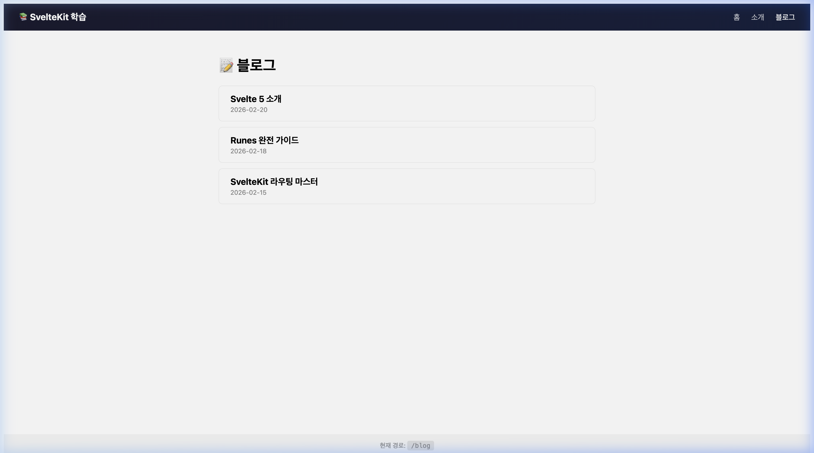

# 🗺️ Step 06: SvelteKit 라우팅

## 학습 목표
- 파일 기반 라우팅 시스템
- 레이아웃 (`+layout.svelte`)
- 동적 라우트 (`[param]`)
- 네비게이션 (`<a>`, `goto`)

---

## 개념 설명

### 파일 = 라우트

```
src/routes/
├── +page.svelte          →  /
├── +layout.svelte        →  모든 페이지 공통 레이아웃
├── about/
│   └── +page.svelte      →  /about
└── blog/
    ├── +page.svelte      →  /blog
    └── [slug]/
        └── +page.svelte  →  /blog/:slug (동적)
```

### 핵심 파일 규칙

| 파일 | 역할 |
|------|------|
| `+page.svelte` | 페이지 UI |
| `+page.server.ts` | 서버 전용 데이터 + Form Actions |
| `+layout.svelte` | 공유 레이아웃 |
| `+error.svelte` | 에러 페이지 |
| `+server.ts` | API 엔드포인트 |

### 💡 [선행 학습] 현재 페이지 정보 가져오기 (`$page` 스토어)

SvelteKit에서는 현재 접속 중인 URL 경로(`pathname`)나 파라미터를 가져오기 위해 내장된 `$page` 스토어를 가장 흔하게 사용합니다. 이 스토어는 앱 전역에서 라우팅 상태를 반응형으로 추적합니다.

```svelte
<script>
  // '$app/stores'는 SvelteKit이 기본 제공하는 내장 모듈입니다. (별도 설치 불필요)
  // page 스토어에는 현재 URL, 파라미터 등 라우팅 정보가 담겨 있습니다.
  import { page } from '$app/stores';
</script>

<!-- 템플릿에서 $page처럼 '$'를 붙이면 스토어 값을 자동 구독합니다. -->
<!-- 경로가 바뀔 때마다 UI가 자동으로 갱신됩니다. -->
<a href="/about" class:active={$page.url.pathname === '/about'}>소개</a>
```

**`$page` 스토어가 담고 있는 주요 정보** (예: URL이 `https://mysite.com/posts/42?q=svelte`일 때):

| 속성 | 설명 | 결과 |
|------|------|------|
| `$page.url.pathname` | 현재 경로 | `'/posts/42'` |
| `$page.url.searchParams` | 쿼리 파라미터 | `.get('q')` → `'svelte'` |
| `$page.params` | 동적 라우트 파라미터 | `{ slug: '42' }` |
| `$page.route.id` | 라우트 패턴 | `'/posts/[slug]'` |

- **`$` 접두사의 의미**: `page`는 Svelte의 **스토어 객체**이고, `$page`처럼 `$`를 붙이면 자동으로 값을 구독합니다. 경로가 바뀌면 `$page.url.pathname` 등도 자동 갱신됩니다.
- **`class:이름={조건}`** : Svelte의 고유 문법으로, 조건이 참일 때만 해당 클래스를 HTML 요소에 붙여줍니다. (이후 네비게이션바 예제에서 등장)

> **🔄 React 비교**: React Router의 `useLocation()` 훅과 유사합니다. `const location = useLocation(); location.pathname`과 같은 역할이지만, Svelte에서는 스토어 문법(`$page`)으로 더 간결하게 표현합니다.

---

## 실습: 파일 생성

### 1. `src/routes/+layout.svelte` 수정

```svelte
<script lang="ts">
  import type { Snippet } from 'svelte';
  import { page } from '$app/stores';

  let { children }: { children: Snippet } = $props();
</script>

<div class="app">
  <nav>
    <div class="logo">📚 SvelteKit 학습</div>
    <div class="links">
      <a href="/" class:active={$page.url.pathname === '/'}>홈</a>
      <a href="/about" class:active={$page.url.pathname === '/about'}>소개</a>
      <a href="/blog" class:active={$page.url.pathname.startsWith('/blog')}>블로그</a>
    </div>
  </nav>
  <main>{@render children()}</main>
  <footer>현재 경로: <code>{$page.url.pathname}</code></footer>
</div>

<style>
  .app { min-height: 100vh; display: flex; flex-direction: column; font-family: 'Inter', system-ui, sans-serif; }
  nav { display: flex; justify-content: space-between; align-items: center; padding: 1rem 2rem; background: linear-gradient(135deg, #1a1a2e, #16213e); color: white; }
  .logo { font-weight: bold; font-size: 1.2rem; }
  .links { display: flex; gap: 1.5rem; }
  .links a { color: rgba(255,255,255,0.7); text-decoration: none; }
  .links a:hover, .links a.active { color: white; }
  main { flex: 1; padding: 2rem; max-width: 800px; margin: 0 auto; width: 100%; }
  footer { padding: 1rem 2rem; background: #f5f5f5; text-align: center; font-size: 0.85rem; color: #888; }
  code { background: #e0e0e0; padding: 0.15rem 0.5rem; border-radius: 4px; }
</style>
```

### 2. `src/routes/about/+page.svelte` 생성

```svelte
<h1>📖 소개 페이지</h1>
<p>이 페이지는 <code>/about</code> 경로의 정적 라우트입니다.</p>
<p><a href="/">← 홈으로 돌아가기</a></p>
```

### 3. `src/routes/blog/+page.svelte` 생성

```svelte
<script lang="ts">
  const posts = [
    { slug: 'svelte-5-intro', title: 'Svelte 5 소개', date: '2026-02-20' },
    { slug: 'runes-guide', title: 'Runes 완전 가이드', date: '2026-02-18' },
    { slug: 'sveltekit-routing', title: 'SvelteKit 라우팅 마스터', date: '2026-02-15' }
  ];
</script>

<h1>📝 블로그</h1>
<div class="posts">
  {#each posts as post}
    <a href="/blog/{post.slug}" class="post-card">
      <h3>{post.title}</h3>
      <p>{post.date}</p>
    </a>
  {/each}
</div>

<style>
  .posts { display: flex; flex-direction: column; gap: 0.75rem; }
  .post-card { padding: 1rem 1.5rem; border-radius: 8px; background: white; border: 1px solid #eee; text-decoration: none; color: inherit; }
  .post-card:hover { border-color: #ff3e00; }
  .post-card h3 { margin: 0 0 0.25rem; }
  .post-card p { margin: 0; color: #888; font-size: 0.85rem; }
</style>
```

### 4. `src/routes/blog/[slug]/+page.svelte` 생성

```svelte
<script lang="ts">
  import { page } from '$app/stores';
</script>

<a href="/blog">← 블로그 목록</a>
<h1>블로그 글: {$page.params.slug}</h1>
<p>동적 라우트 <code>/blog/[slug]</code>를 통해 렌더링되었습니다.</p>
<p>URL 파라미터 <code>slug</code> = <strong>{$page.params.slug}</strong></p>
```

---

## 확인

브라우저에서 `http://localhost:5174/blog` 접속 후 다음 화면이 나오는지 확인합니다:

<div align="center">
  
  <p><em>(SvelteKit 라우팅 실습 화면 — 블로그 페이지)</em></p>
</div>

- 네비게이션 바의 링크가 활성 상태 표시되는지 확인
- `/about` → 소개 페이지 표시
- `/blog` → 블로그 목록, 각 글 클릭 시 `/blog/[slug]`로 이동
- 하단 footer에 현재 경로 표시

---

## 🎯 다음 단계

[08-data-loading.md](./08-data-loading.md) →
