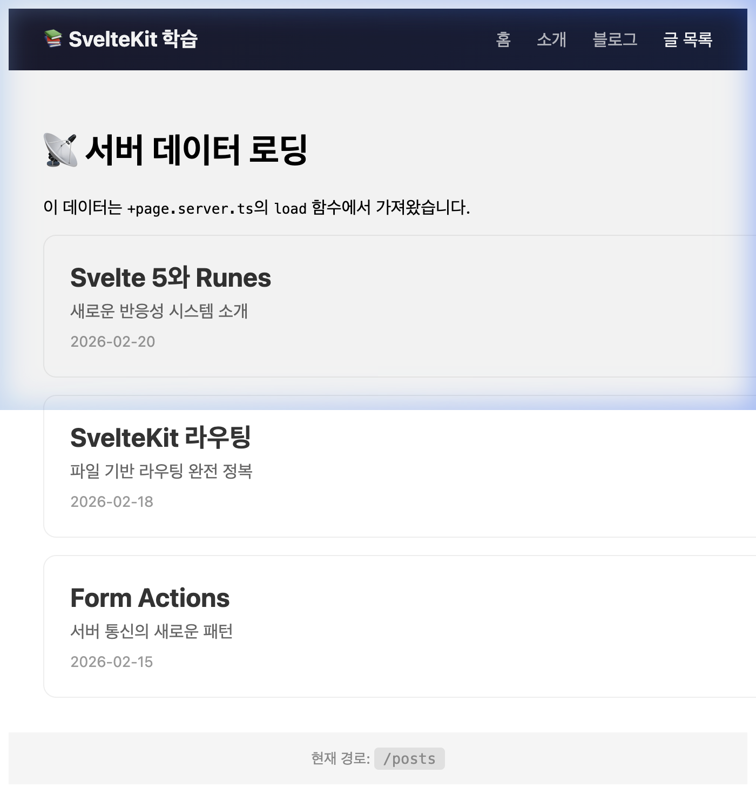

# 📡 Step 07: 데이터 로딩

## 학습 목표
- `load` 함수 (`+page.server.ts`)
- 서버 → 클라이언트 데이터 전달
- 타입 안전한 `$props()` 활용
- 에러 핸들링

---

## 개념 설명

### 💡 [선행 학습] `./$types` — SvelteKit 자동 생성 타입

SvelteKit은 각 라우트 폴더마다 **TypeScript 타입을 자동 생성**합니다. 개발자가 직접 만들거나 관리할 필요가 없으며, `load` 함수의 매개변수와 반환값에 **자동 완성 + 타입 검사**가 적용됩니다.

| 파일 | 자동 생성 타입 | 용도 |
|------|------|------|
| `+page.server.ts` | `PageServerLoad` | 서버 전용 load 함수 |
| `+page.ts` | `PageLoad` | 유니버설(서버+클라이언트) load 함수 |
| `+layout.server.ts` | `LayoutServerLoad` | 레이아웃 서버 load 함수 |

```typescript
// src/routes/posts/+page.server.ts

// './$types'는 SvelteKit이 빌드 시 자동 생성하는 타입 파일입니다. (직접 만들 필요 없음)
// PageServerLoad 타입을 적용하면 매개변수(params, url, cookies 등)에 자동 완성이 지원됩니다.
import type { PageServerLoad } from './$types';

export const load: PageServerLoad = async () => {
  const posts = await fetchPosts(); // DB, API 등
  return { posts };  // → 컴포넌트에서 data.posts로 접근
};
```

```svelte
<!-- src/routes/posts/+page.svelte -->
<script lang="ts">
  // load 함수에서 return한 데이터가 data props에 타입으로 자동 연결됩니다.
  // data.posts의 타입이 자동 추론되어 IDE에서 자동 완성이 동작합니다.
  let { data } = $props();
</script>

{#each data.posts as post}
  <h2>{post.title}</h2>
{/each}
```

> **🔄 React 비교**: Next.js의 `getServerSideProps`와 비슷하지만, SvelteKit은 타입이 자동 생성되어 `params` 등의 타입까지 경로에 맞게 추론됩니다. (예: `/blog/[slug]`라면 `params.slug`가 `string`으로 자동 타입 지정)

---

## 실습: 파일 생성

### 1. `src/routes/posts/+page.server.ts` 생성

```typescript
import type { PageServerLoad } from './$types';

export const load: PageServerLoad = async () => {
  const posts = [
    { id: 1, title: 'Svelte 5와 Runes', summary: '새로운 반응성 시스템 소개', date: '2026-02-20' },
    { id: 2, title: 'SvelteKit 라우팅', summary: '파일 기반 라우팅 완전 정복', date: '2026-02-18' },
    { id: 3, title: 'Form Actions', summary: '서버 통신의 새로운 패턴', date: '2026-02-15' }
  ];
  return { posts };
};
```

### 2. `src/routes/posts/+page.svelte` 생성

```svelte
<script lang="ts">
  let { data } = $props();
</script>

<h1>📡 서버 데이터 로딩</h1>
<p>이 데이터는 <code>+page.server.ts</code>의 <code>load</code> 함수에서 가져왔습니다.</p>

<div class="posts">
  {#each data.posts as post}
    <article>
      <h2>{post.title}</h2>
      <p>{post.summary}</p>
      <time>{post.date}</time>
    </article>
  {/each}
</div>

<style>
  .posts { display: flex; flex-direction: column; gap: 1rem; margin-top: 1rem; }
  article { padding: 1.5rem; border-radius: 12px; background: white; border: 1px solid #eee; }
  article h2 { margin: 0 0 0.5rem; color: #333; }
  article p { color: #666; margin: 0 0 0.5rem; }
  time { color: #999; font-size: 0.85rem; }
</style>
```

### 3. 네비게이션에 추가 (`+layout.svelte`)

```svelte
<a href="/posts" class:active={$page.url.pathname === '/posts'}>글 목록</a>
```

---

## 확인

브라우저에서 `http://localhost:5174/posts` 접속 후 다음 화면이 나오는지 확인합니다:

<div align="center">
  
  <p><em>(서버 데이터 로딩 실습 화면)</em></p>
</div>

- `/posts` 접속 시 3개 글이 표시
- 데이터가 서버에서 미리 로드 (페이지 소스 보기에서 HTML 확인)

---

## 🎯 다음 단계

[09-form-actions.md](./09-form-actions.md) →
